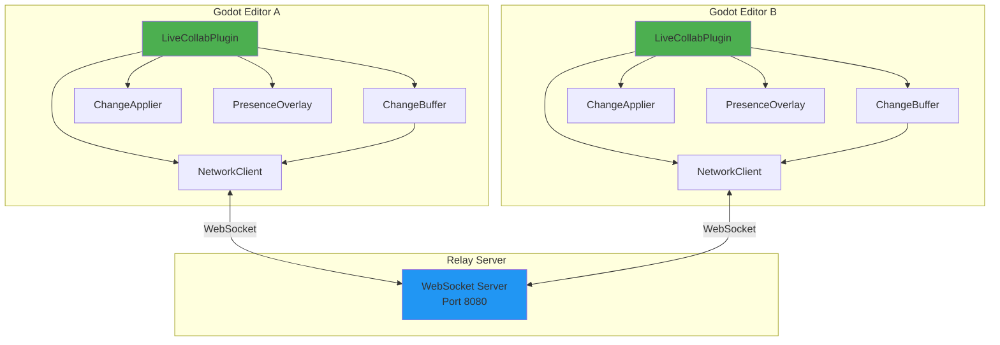
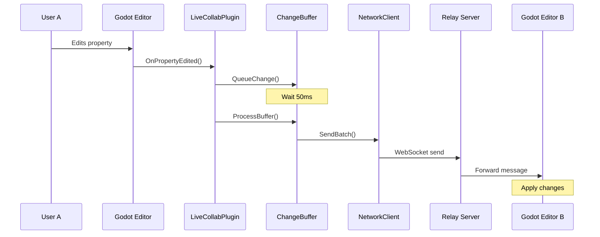
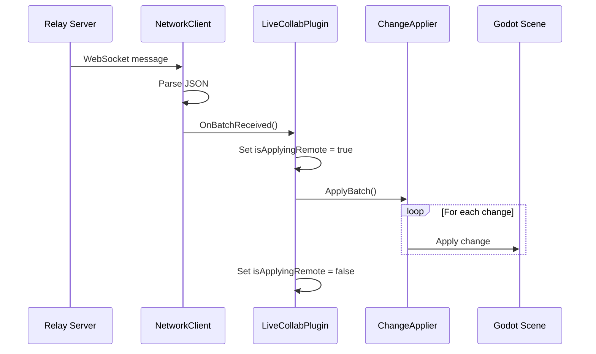
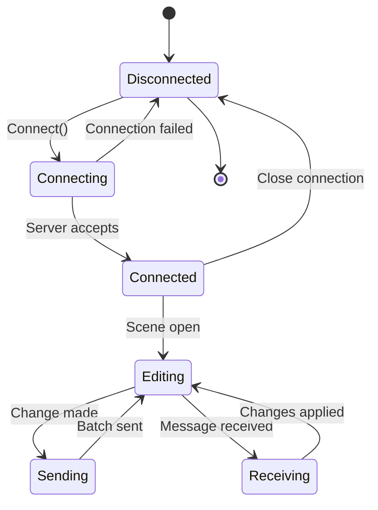
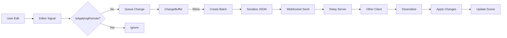
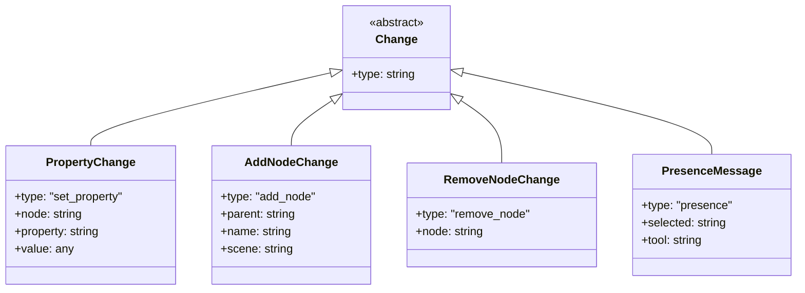
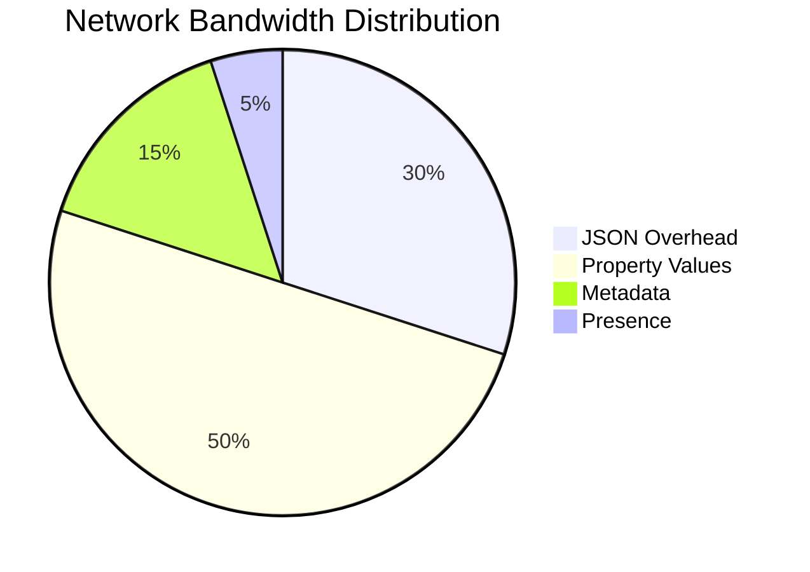
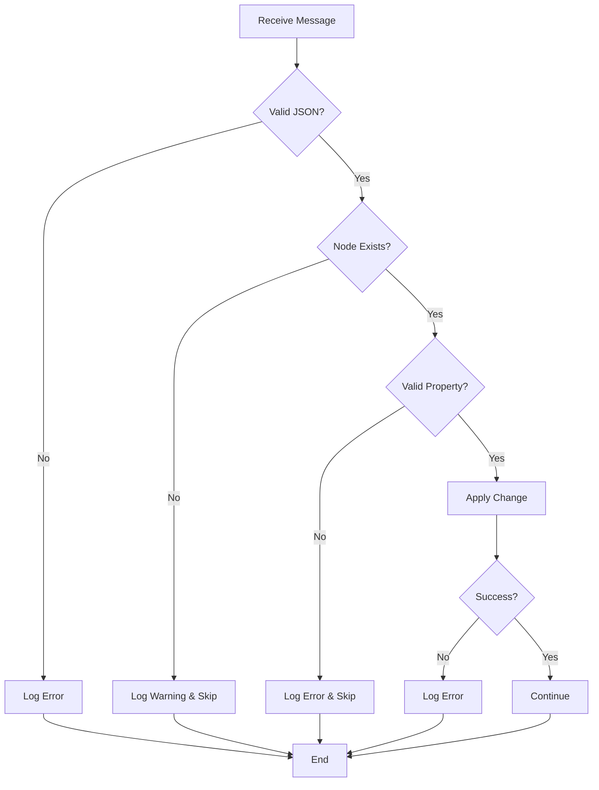

# System Architecture Diagram

## Component Overview



## Message Flow - Outgoing Change



## Message Flow - Incoming Change



## State Diagram



## Data Flow



## Network Topology Options

### Option 1: Local Testing
```
┌─────────────┐         ┌─────────────┐
│  Editor A   │         │  Editor B   │
│ localhost   │         │ localhost   │
└──────┬──────┘         └──────┬──────┘
       │                       │
       └───────┬───────────────┘
               │
        ┌──────▼──────┐
        │   Server    │
        │  localhost  │
        │   :8080     │
        └─────────────┘
```

### Option 2: LAN Setup
```
┌─────────────┐         ┌─────────────┐
│  Editor A   │         │  Editor B   │
│ 192.168.1.2 │         │ 192.168.1.3 │
└──────┬──────┘         └──────┬──────┘
       │                       │
       └───────┬───────────────┘
               │
        ┌──────▼──────┐
        │   Server    │
        │192.168.1.10 │
        │   :8080     │
        └─────────────┘
```

### Option 3: Internet Setup
```
┌─────────────┐         ┌─────────────┐
│  Editor A   │         │  Editor B   │
│   USA       │         │   Europe    │
└──────┬──────┘         └──────┬──────┘
       │                       │
       │   Internet            │
       └───────┬───────────────┘
               │
        ┌──────▼──────┐
        │   Server    │
        │ VPS/Cloud   │
        │   :8080     │
        └─────────────┘
```

## Change Types



## Conflict Resolution Timeline

```mermaid
gantt
    title Last-Write-Wins Example
    dateFormat X
    axisFormat %L ms
    
    section User A
    Edit property     :0, 10
    Queue change      :10, 20
    Wait for batch    :20, 50
    Send batch        :50, 70
    
    section User B
    Edit same property:20, 30
    Queue change      :30, 40
    Wait for batch    :40, 70
    Send batch        :70, 90
    
    section Network
    Receive A's batch :70, 80
    Receive B's batch :90, 100
    
    section Result
    Final value is B's:100, 100
```



## Performance Metrics



## Error Handling Flow


